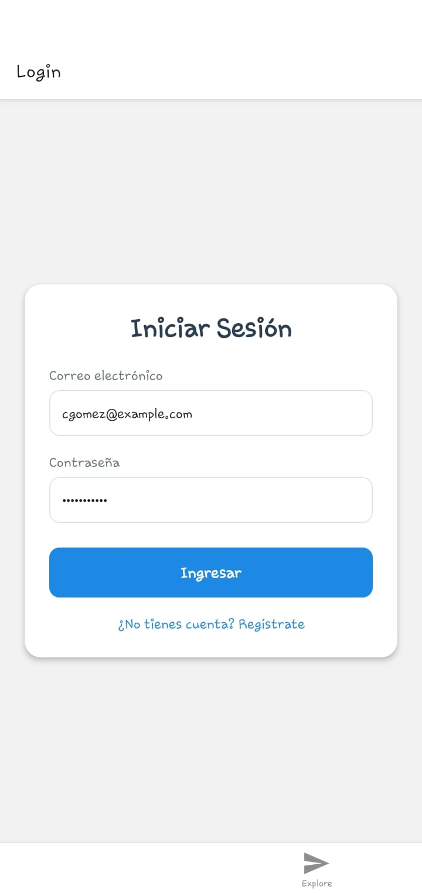
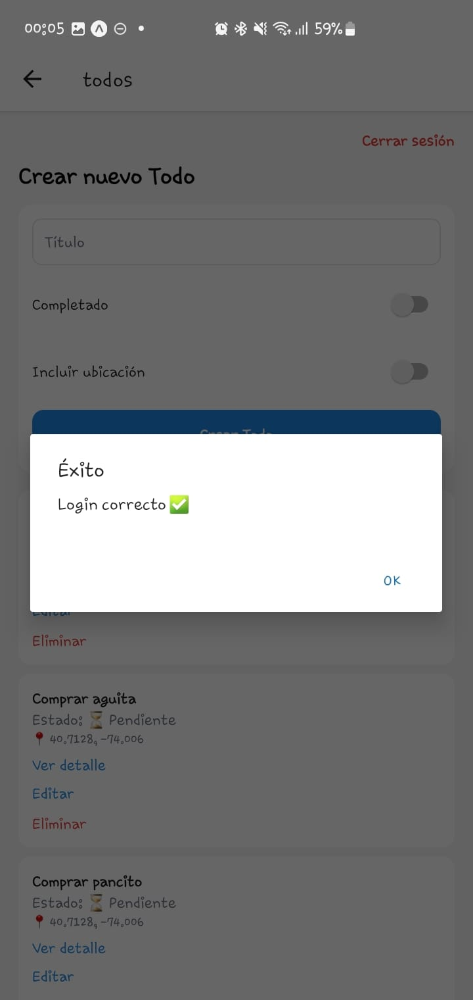
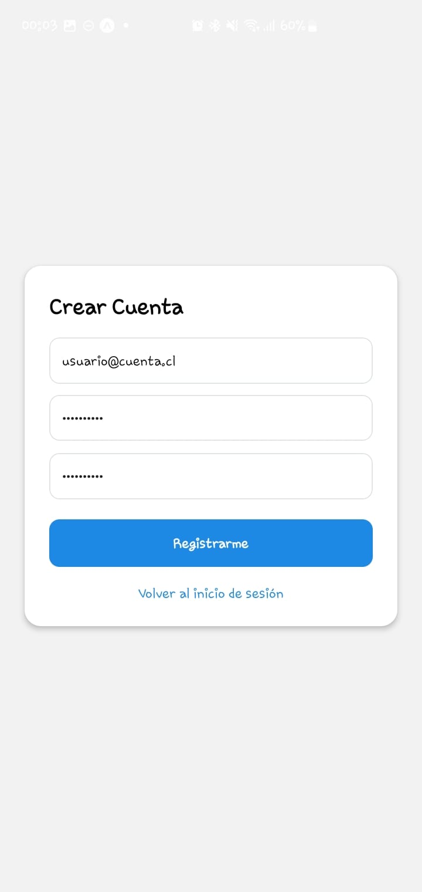
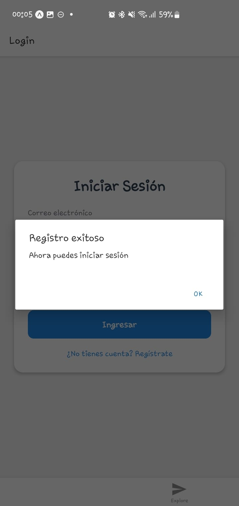
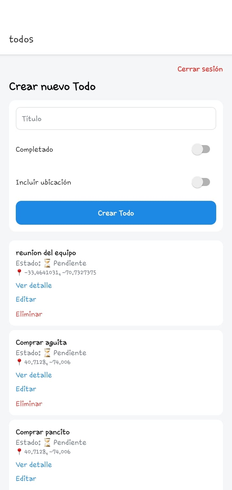
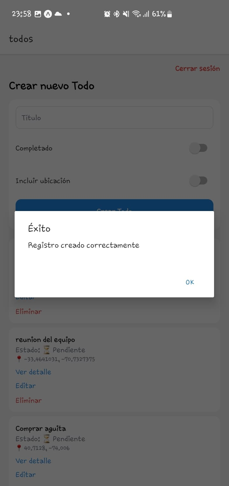
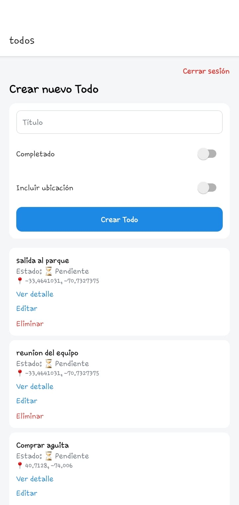
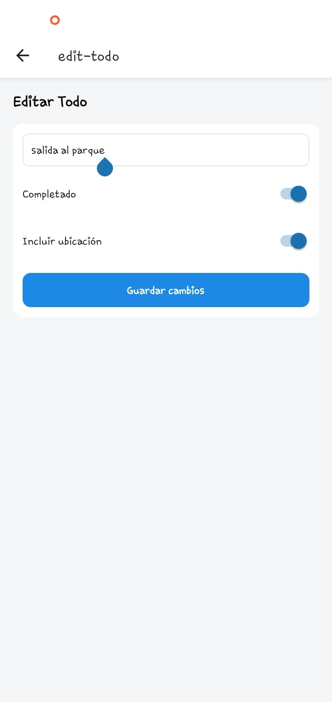
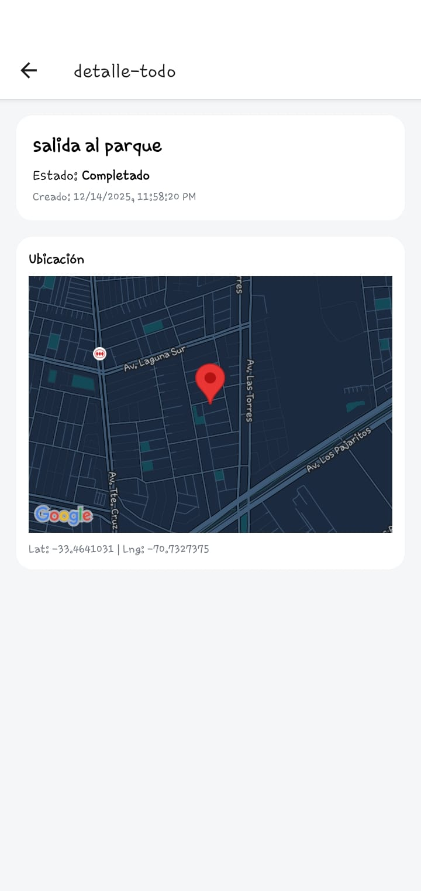
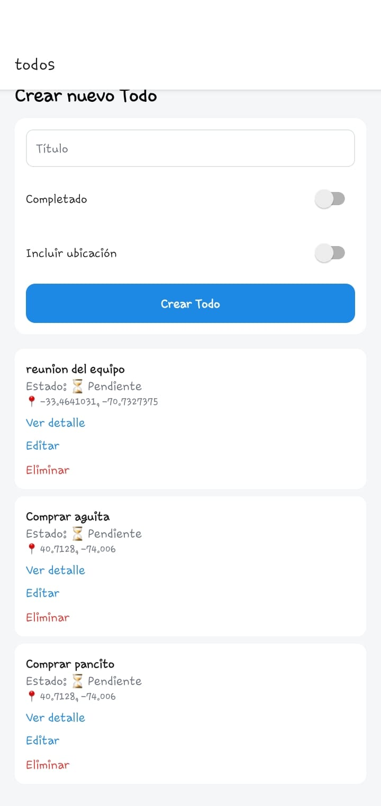

# 📱 Todo Mobile App (React Native + Expo)

Aplicación mobile desarrollada con **React Native + Expo**, que permite a un usuario autenticado **registrarse, iniciar sesión y gestionar un listado de Todos**, incluyendo:

- Autenticación JWT
- CRUD completo de Todos
- Captura de ubicación GPS
- Visualización de mapa por Todo
- Manejo de sesión (login, logout, expiración)


---

Usuarios registrados
cgomez@example.com / password123 - Lista con todos
user@example.com / password123 - Sin todos

---

## 🚀 Tecnologías

- **React Native** (Expo)
- **Expo Router** (file-based routing)
- **TypeScript**
- **Axios** (HTTP client)
- **Expo SecureStore** (almacenamiento seguro de token)
- **Expo Location** (GPS)
- **React Native Maps** (mapas)

---

## 📂 Estructura del proyecto

```
app/
 ├─ index.tsx              # Login
 ├─ register.tsx           # Registro
 ├─ (protected)/
 │   ├─ _layout.tsx        # Protección por sesión
 │   ├─ todos.tsx          # Listado + creación
 │   ├─ detalle-todo.tsx   # Detalle del Todo
 │   ├─ edit-todo.tsx      # Edición
src/
 ├─ api/
 │   └─ client.ts          # Axios + interceptores
 ├─ services/
 │   ├─ auth.service.ts
 │   ├─ todo-list-service.ts
 │   ├─ token.service.ts
 │   └─ session.service.ts
 ├─ theme/
 └─ types/
```

---

## ⚙️ Requisitos previos

- **Node.js v22**
- **npm** o **pnpm**
- **Expo CLI**

```bash
npm install -g expo-cli
```

---

## ▶️ Levantar el proyecto en local

```bash
npm install
npx expo start
```

Luego:
- Presiona **a** para Android Emulator
- Presiona **w** para Web
- Escanea QR con Expo Go

---

## 🔐 Variables de entorno

Este proyecto utiliza **variables de entorno públicas de Expo**.

### 📁 `.env`

```env
EXPO_PUBLIC_API_BASE_URL=https://todo-list-hono-api-ipss.ibreeqq.workers.dev
```

> ⚠️ Todas las variables que se usen en Expo **deben comenzar con `EXPO_PUBLIC_`**

---

## 🌍 Configuración por entorno

### 🧪 Local

```env
EXPO_PUBLIC_API_BASE_URL=http://localhost:8787
```

### 🚀 Producción

```env
EXPO_PUBLIC_API_BASE_URL=https://todo-list-hono-api-ipss.ibreeqq.workers.dev
```

---

## 🔑 Manejo de sesión

- El token JWT se guarda en **Expo SecureStore**
- Se valida expiración usando `exp`
- Logout automático al recibir **401**
- Rutas protegidas con `(protected)/_layout.tsx`

---

## 📡 Endpoints utilizados

### 🔐 Autenticación

#### Login

```
POST /auth/login
```

Body:
```json
{
  "email": "user@example.com",
  "password": "password123"
}
```

Respuesta:
```json
{
  "token": "jwt-token"
}
```




---

#### Registro

```
POST /auth/register
```

Body:
```json
{
  "email": "user@example.com",
  "password": "password123"
}
```




---

### ✅ Todos

#### Listar Todos

```
GET /todos
Authorization: Bearer <token>
```

---
Lista todos los todo existentes y permite crear nuevo

---

#### Obtener Todo

```
GET /todos/{id}
Authorization: Bearer <token>
```

---
Detalle del registro

---

#### Crear Todo

```
POST /todos
Authorization: Bearer <token>
```

Body:
```json
{
  "title": "Nuevo Todo",
  "completed": false,
  "location": {
    "latitude": -33.4,
    "longitude": -70.6
  }
}
```
---
Se crea nuevo registro "salida al parque"


Se muestra el nuevo registro en el listado

---

#### Editar Todo

```
PUT /todos/{id}
Authorization: Bearer <token>
```

---
Se edita todo, completado cambia a true


Se muestra todo modificado, con completado en true

---

#### Eliminar Todo

```
DELETE /todos/{id}
Authorization: Bearer <token>
```

---
Se elimina registro todo


Se muestra listado sin el registro eliminado

---

## 🗺️ Funcionalidades destacadas

- ✔ Login / Registro
- ✔ Sesión persistente
- ✔ CRUD de Todos
- ✔ Ubicación GPS opcional
- ✔ Visualización en mapa
- ✔ Manejo de errores y loaders

---

## 🔒 Seguridad

- JWT enviado vía `Authorization: Bearer`
- Token almacenado de forma segura
- Expiración validada en cliente

---

## 🧪 Debugging

```bash
npx expo start -c
```

Limpia cache si hay problemas.

---

## 📌 Pendientes / Mejoras

- Subida de imagen por Todo
- Refresh token
- Pull to refresh
- Testing (Jest / Detox)

---

## 👨‍💻 Autor

Proyecto desarrollado como base de aplicación mobile moderna con Expo.

---

## 📄 Licencia

MIT

